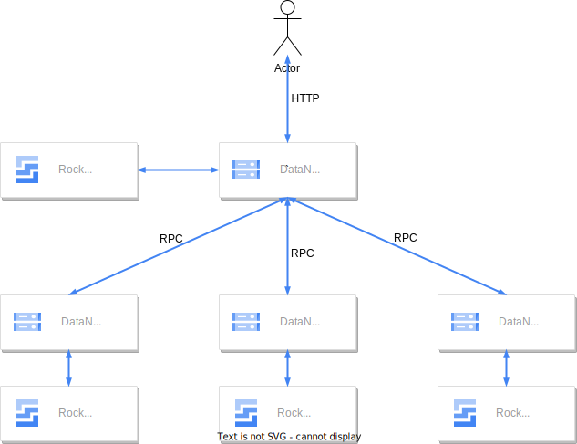

# 设计

启动多个DataNode服务。提供文件上传/下载的HTTP接口供用户使用；另外提供文件上传/下载/校验文件是否存在的RPC接口供其他DataNode使用。用户从DataNode 0（也可以是任意的DataNode）发起上传/下载操作。

## 上传

DataNode 0处理上传请求：

1. 检查本机是否包含上传的文件hash（SHA256），若文件hash（SHA256）已存在则返回上传成功。
2. 若文件不存在，则依据配置的副本数，随机选择对应数量的DataNode节点，调用这些DataNode节点的上传RPC接口将文件上传到对应的DataNode节点。
3. 上传成功后返回文件hash（SHA256）给用户。

## 下载

DataNode 0处理下载请求：

1. 检查本机是否包含上传的文件hash（SHA256），若文件hash（SHA256）存在则返回文件给用户。
2. 若文件不存在，则随机向其他DataNode节点发起文件定位查询（查询文件是否在该节点存在），直到找到文件并从包含该文件的DataNode下载文件，或者是所有节点均无此文件。
3. 返回文件或者文件不存在信息给用户。
