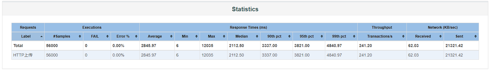
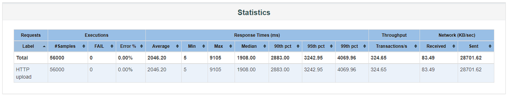

# JMeter

## 虚拟机配置

CPU(s): 5

Memory: 5GB

## 存储服务

虚拟机部署6个实例, 一次上传保存4个副本

## JMeter脚本

### 上传

#### 前置

脚本([链接](./storage.jmx)):

1. 线程数: 700
2. 循环次数: 80
3. 连接超时: 30s
4. 响应超时: 30s

其他:
1. JMeter和服务在同一个虚拟机
2. 测试上传文件10000个59k~118k的文本文件

#### 报告

两轮结果如下

